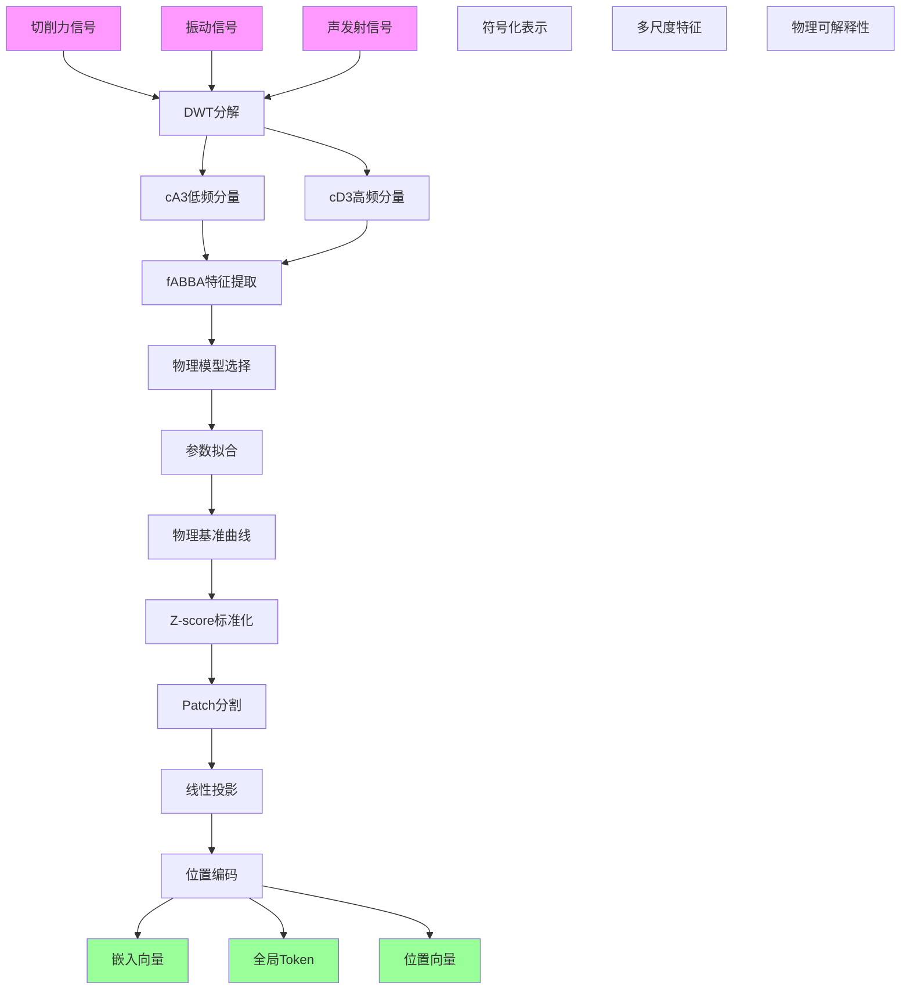
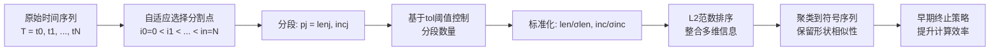
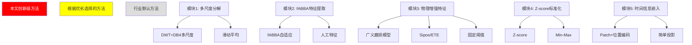

# 论文数据处理方法拆解报告

**论文标题**: Physics-based feature enhancement method and physics constraint Transformer model for multi-step tool wear and RUL prediction

**来源**: CIRP Journal of Manufacturing Science and Technology 65 (2026) 179–206

---

## 一、数据处理总体流程



---

## 二、各处理模块详细分析

### 模块1: 多尺度信号分解 (Multi-scale Signal Decomposition)

#### 方法选择依据与等级

| 等级 | 方法 | 选择原因 | 产生的效果 |
|------|------|----------|------------|
| **★★★ 本文创新级** | DWT (离散小波变换) + DB4小波基 + 3层分解 | 相比时域分析能提取多尺度特征；DB4小波基适合捕捉瞬态冲击特征；3层分解平衡了计算效率与特征完整性 | 将非平稳加工信号有效分解为低频近似分量(cA3)和高频细节分量(cD3)，为后续fABBA特征提取提供多尺度表征 |
| 行业默认 | 滑动窗口平均 | 简单降噪但会模糊时域边界 | 仅做基础降噪，无法提取多尺度信息 |

#### 处理对象与结果形式

```
输入: 原始信号 x(t)
     ├── 切削力: Fx, Fy, Fz (采样率50kHz / 5kHz / 10.24kHz)
     ├── 振动:加速度计 (采样率10.24kHz)
     └── 声发射:AE传感器 (采样率78.125kHz)

处理: DWT分解
     ├── Level 1: cD1 (高频细节)
     ├── Level 2: cD2 (高频细节)
     └── Level 3: cD3 (高频细节) + cA3 (低频近似)

输出:
     ├── 低频近似分量 cA3 - 表征磨损趋势
     └── 高频细节分量 cD3 - 表征磨损突变
```

#### 验证方式

- **Fig. 7**: 展示X轴切削力在第32次切削时的多尺度分解结果
  - (a) 原始信号
  - (b)-(d) Level 1-3 高频细节系数
  - (e) Level 3 低频近似系数

---

### 模块2: fABBA特征提取 (Feature Extraction based on STSA)

#### 方法选择依据与等级

| 等级 | 方法 | 选择原因 | 产生的效果 |
|------|------|----------|------------|
| **★★★ 本文创新级** | fABBA (快速自适应布朗桥聚合) | 1) 自适应分割避免人工选择阈值；2) 相比SVD/DWT等方法不依赖领域知识；3) 保留趋势和周期关键特征同时降维；4) 引入早期终止策略提升效率 | 从多尺度分解信号中提取6个关键特征(见下表)，实现自动化的特征工程 |
| 行业默认 | 人工特征工程<br/>(时域统计：均值、方差、峰值等) | 需要领域专家知识；主观性强 | 特征选择可能遗漏关键信息 |
| 根据优劣选择 | SVD奇异值分解 | 保留主要能量但物理意义不明确 | 可用于降维但不适合时序特征提取 |

#### 提取的特征列表 (Table 2)

| 特征名称 | 数学表达式 | 物理含义 |
|----------|------------|----------|
| 压缩比 (Compression ratio) | N/K | 表征信号压缩程度 |
| 段数 (Segment count) | K | 表征信号复杂度 |
| 段长度均值 (Mean of segment length) | (1/K)Σlk | 表征信号平稳性 |
| 段长度标准差 (Std of segment length) | √[(1/K)Σ(lk-l)²] | 表征信号波动 |
| 增量均值 (Mean of segmented increments) | (1/K)ΣΔk | 表征磨损变化趋势 |
| 增量标准差 (Std of segment increments) | √[(1/K)Σ(Δk-Δ)²] | 表征磨损变化波动 |
| 长度×增量 (Product of length and increment) | lk×Δk (i=0,1,2,3,4) | 综合特征 |

#### fABBA核心算法步骤



#### 处理对象与结果形式

```
输入: DWT分解后的多尺度信号
     ├── cA3 (低频近似分量)
     └── cD3 (高频细节分量)

fABBA处理:
     ├── 自适应分段: 根据局部特征动态分割
     └── 符号化: 映射到符号序列

输出: 6个统计特征
     ├── low_comp_ratio, high_comp_ratio
     ├── low_segment_count, high_segment_count
     ├── low_segment_len_mean, high_segment_len_mean
     └── ... (共12个特征，6个来自低频+6个来自高频)
```

---

### 模块3: 物理增强特征 (Physics-based Feature Enhancement)

#### 方法选择依据与等级

| 等级 | 方法 | 选择原因 | 产生的效果 |
|------|------|----------|------------|
| **★★★ 本文创新级** | 广义磨损模型 + 非线性最小二乘拟合 | 1) 避免残差物理融合的梯度不稳定和过拟合；2) 无需显式建模误差；3) 提供跨加工条件的统一参考基准 | 生成物理基准磨损曲线作为新特征，R²达0.93左右，提升模型泛化能力 |
| 根据优劣选择 | Sipos模型 | 指数形式描述磨损-时间关系 | R²约0.77，效果不如广义模型 |
| 根据优劣选择 | 扩展Taylor方程 (ETE) | 经典幂律关系 | R²约0.85，中等效果 |
| 行业默认 | 固定阈值判断 | 简单但不考虑个体差异 | 无法捕捉磨损演化趋势 |

#### 物理模型对比 (Table 7)

| 模型 | R² (C1+C4→C6) | R² (C4+C6→C1) | R² (C1+C6→C4) | 平均R² |
|------|---------------|---------------|---------------|--------|
| **广义磨损模型** | **0.9328** | **0.8474** | **0.8677** | **0.8826** |
| Sipos | 0.7727 | 0.7043 | 0.7511 | 0.7427 |
| ETE | 0.8991 | 0.8219 | 0.7995 | 0.8402 |

#### 广义磨损模型数学表达

$$W = a \cdot \ln(b \cdot t + 1) + c \cdot t^3$$

其中:
- W: 磨损值
- t: 时间/切削次数
- a, b, c: 可调参数 (通过拟合确定)

#### 参数拟合结果示例 (Table 5, C6为目标组)

| 参数 | C1+C4→C6 | C4+C6→C1 | C1+C6→C4 |
|------|----------|----------|----------|
| a | 1.2136±0.1747 | 13.739±1.927 | 10.714±0.9167 |
| b | 624.04±0.4122 | 2.4454±32.109 | 561.19±0.2104 |
| c | (3.77±0.22)×10⁻⁸ | (3.06±0.20)×10⁻⁸ | (3.11±0.12)×10⁻⁸ |
| d | -63.252±21.202 | 1.0532±171.55 | -50.426±11.026 |

#### 处理对象与结果形式

```
输入:
     ├── 训练集磨损标签 (W_ture)
     └── 验证集磨损标签

处理:
     ├── 选择广义磨损模型
     ├── 非线性最小二乘法拟合参数
     └── SSR = Σ(WTure - WFitted)² 最小化

输出:
     └── 物理基准磨损曲线 (physics-enhanced feature)
         - 作为新特征输入神经网络
         - 物理一致性保证：磨损值随时间单调递增
```

#### 验证方式

- **Fig. 8**: 不同数据划分下广义磨损模型的拟合结果
- **Fig. 9**: 拟合值与实际值对比 (C1, C4, C6三组)
- **Table 6**: 广义磨损模型95%置信区间参数范围
- **Table 15**: 自建数据集的模型参数

---

### 模块4: Z-score标准化 (Data Standardization)

#### 方法选择依据与等级

| 等级 | 方法 | 选择原因 | 产生的效果 |
|------|------|----------|------------|
| 根据优劣选择 | Z-score标准化 | 1) 保留通道间物理相关性；2) 避免梯度爆炸；3) 加速模型收敛 | 特征均值为0，标准差为1，保持物理可解释性 |
| 行业默认 | Min-Max归一化 | 简单线性映射 | 可能破坏多通道信号的物理关联 |
| 行业默认 | L2归一化 | 常用但不适合保留物理单位 | 失去物理量纲信息 |

#### 处理对象与结果形式

```
输入: fABBA提取的原始特征 + 物理增强特征
     ├── 低频特征 (6个)
     ├── 高频特征 (6个)
     └── 物理增强特征 (1个)

处理: Z = (X - μ) / σ
     - 每个特征独立标准化
     - 保留特征间的物理相关结构

输出: 标准化特征向量
     - 均值为0，标准差为1
     - 供神经网络使用
```

---

### 模块5: 时间信息嵌入 (Historical Information Embedding)

#### 方法选择依据与等级

| 等级 | 方法 | 选择原因 | 产生的效果 |
|------|------|----------|------------|
| **★★★ 本文创新级** | Patch分割 + 位置编码 + 全局Token | 1) Patch分割减少全局自注意力计算复杂度；2) 位置编码注入时序位置信息；3) 全局Token捕获整体状态 | 高效处理时序依赖，保留多变量时间序列的局部和全局信息 |
| 行业默认 | 简单线性投影 | 计算简单但忽略位置信息 | 无法捕捉时序关系 |

#### 位置编码公式 (Eq. 13)

$$PE(pos, 2i) = \sin\left(\frac{pos}{10000^{2i/d_{model}}}\right)$$
$$PE(pos, 2i+1) = \cos\left(\frac{pos}{10000^{2i/d_{model}}}\right)$$

#### Patch分割 (Eq. 14)

$$X_{patch} = unfold(X, size=P, stride=P)$$

#### 处理对象与结果形式

```
输入: 标准化特征序列 X ∈ R^{N×L}
     - N: 预测变量数量
     - L: 序列长度

处理步骤:
     ├── Patch分割: 等间隔展开为L/P个局部子序列
     ├── 线性投影: 映射到dmodel维度
     ├── 位置编码: Sin/Cos函数生成位置向量
     └── 全局Token: gn ∈ R^dmodel分配给每个变量

输出: 三部分组成
     ├── Zpos: 位置编码向量
     ├── gn: 全局Token
     └── Z: 特征嵌入向量
```

---

## 三、数据处理方法等级汇总



---

## 四、验证方式汇总

### 4.1 信号分解验证

| 验证内容 | 验证方式 | 结果形式 |
|----------|----------|----------|
| 多尺度分解效果 | 可视化各层分解结果 | **Fig. 7**: 波形图对比原始信号与分解后各层信号 |

### 4.2 物理模型验证

| 验证内容 | 验证方式 | 结果形式 |
|----------|----------|----------|
| 物理模型拟合精度 | R²决定系数 | **Table 7**: 三种物理模型R²对比，广义模型最优 |
| 拟合效果可视化 | 拟合曲线vs实际数据 | **Fig. 8**: 不同数据划分的拟合结果<br/>**Fig. 9**: 拟合值与实际值散点图 |
| 参数置信区间 | 95%置信区间 | **Table 6, Table 15**: 参数上下界 |

### 4.3 特征工程验证

| 验证内容 | 验证方式 | 结果形式 |
|----------|----------|----------|
| 特征重要性 | SHAP分析 | **Fig. 18**: Top 13特征重要性排序<br/>**Fig. 21**: 特征重要性热力图 |
| 物理增强特征贡献 | SHAP值分析 | 物理增强特征在12步预测中贡献8%+重要性 |

### 4.4 模型性能验证

| 验证内容 | 验证方式 | 结果形式 |
|----------|----------|----------|
| 多步预测精度 | RMSE, MAE, R² | **Table 20-22**: 各预测步长(12/24/36/48)性能指标 |
| 区间预测可靠性 | PICP, PINAW | **Table 18-19**: 区间预测覆盖率与区间宽度 |
| 统计显著性 | Wilcoxon符号秩检验 | p-value < 0.005，显著优于基线模型 |
| 校准可靠性 | 可靠性图表 | **Fig. 17**: 预测值vs真实值校准图 |
| 计算效率 | 训练/推理时间 | **Table 23-24**: 时间对比(ms) |

---

## 五、核心创新点总结

### 数据处理方法创新 (相对于传统方法)

| 创新点 | 传统方法局限 | 本文方法优势 |
|--------|-------------|-------------|
| **fABBA自适应特征提取** | 依赖领域专家手工选择特征 | 自动从多尺度信号提取特征，避免信息隐含损失 |
| **物理增强基准曲线** | 残差融合需要显式建模误差 | 直接生成物理基准曲线，避免梯度不稳定和过拟合 |
| **广义磨损模型选择** | 使用单一物理模型 | 通过R²对比选择最优模型，泛化能力强 |
| **Z-score保留物理可解释性** | Min-Max破坏通道间关联 | 保持多通道信号的物理相关性 |

---

## 六、数据集与实验配置

### PHM2010数据集

| 配置 | 训练集 | 验证集 | 测试集 |
|------|--------|--------|--------|
| 配置1 | C4 | C6 | C1 |
| 配置2 | C6 | C1 | C4 |
| 配置3 | C1 | C4 | C6 |

### 自建数据集

| 配置 | 训练集 | 验证集 | 测试集 |
|------|--------|--------|--------|
| 配置1 | T1 | T2 | T3 |
| 配置2 | T2 | T3 | T1 |
| 配置3 | T3 | T1 | T2 |

---

*报告生成时间: 2026-05-25*
*基于论文: 2026-CIRP-Jiang-Transformer-Physics.pdf*
