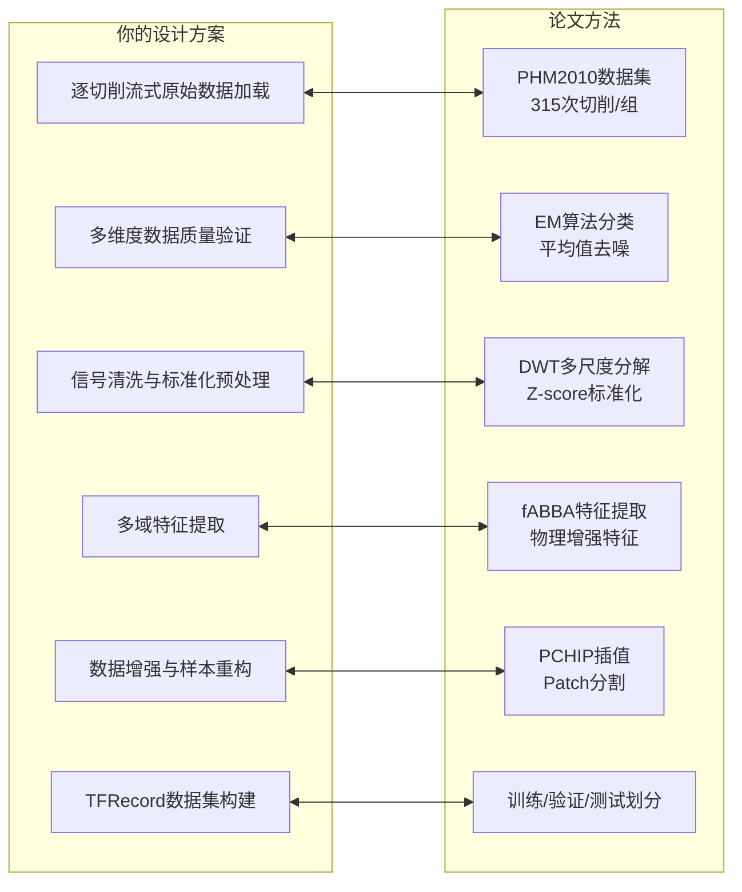
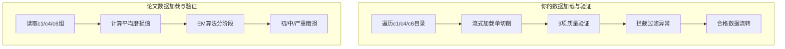
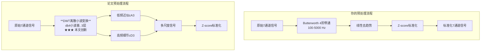
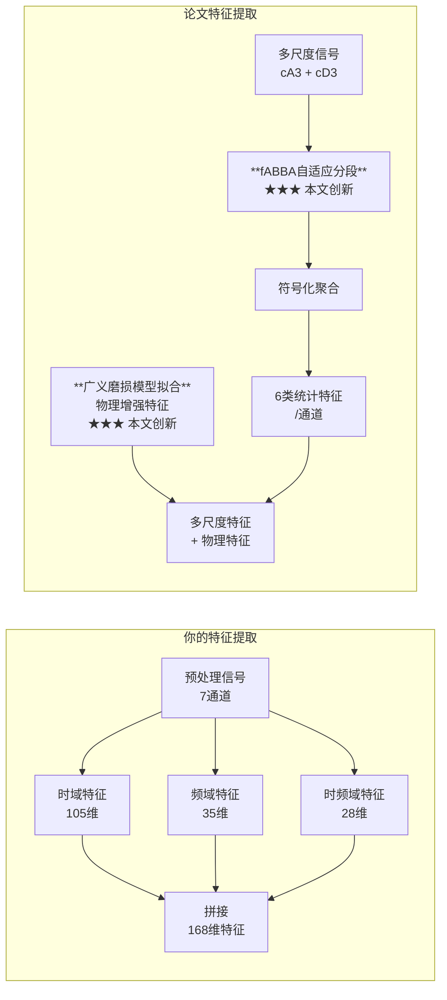
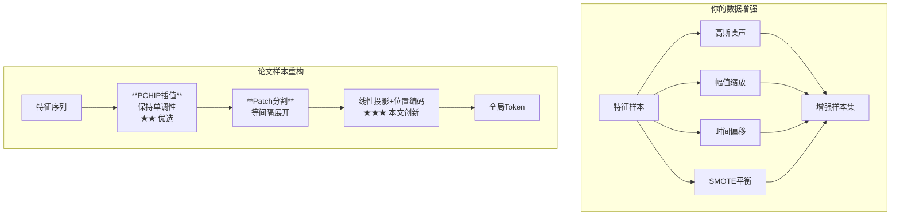
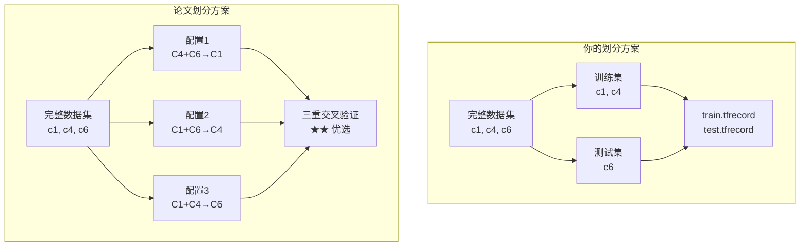
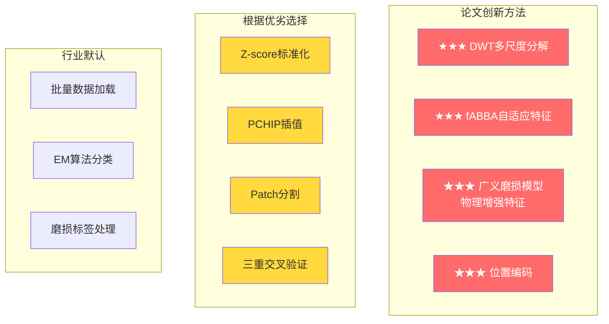
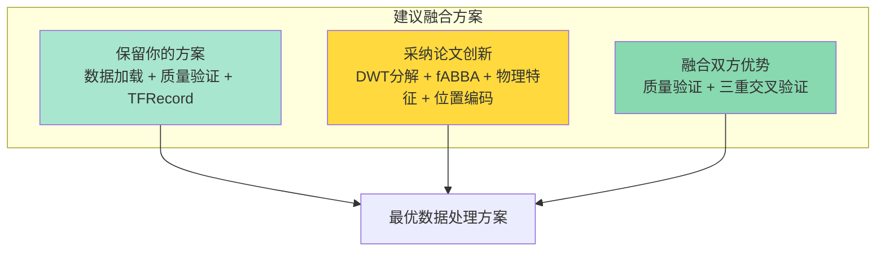

# 设计方案与论文方法对比分析

## 文档概述

本文档对比分析了**你的设计方案**与**论文（2026 CIRP Jiang）**提出的数据处理方法，涵盖从原始数据到TFRecord数据集的完整流程。

---

## 总体流程对比

---

## 模块1：数据加载 & 质量验证

| 维度 | 你的设计方案 | 论文方法 | 方法等级 | 对比分析 |
|------|--------------|----------|----------|----------|
| **数据加载方式** | 逐切削流式加载 生成器模式，低内存 | 批量读取CSV 315次切削/组 | 行业默认 | 你的方案更适合大规模数据，避免内存溢出 |
| **ID标识** | `{tool_id}_cut{num}`格式 全局唯一 | 仅cut编号 | 行业默认 | 你的方案有完整的ID追踪机制 |
| **质量验证** | 9项逐项验证 空值/全零/断点/幅值/相关性/标签等 | EM算法分类磨损阶段 平均值去噪异常刃 | 根据优劣选择 | 你的方案更全面，论文方案更聚焦物理含义 |
| **异常处理** | 拦截过滤并记录 单条异常不影响整体 | 平均磨损值作为标签 消除个体异常 | 根据优劣选择 | 各有侧重，你的方案适合工程化，论文方案更贴合物理 |
| **验证标准** | 幅值范围: 力(-1000,1000)N 振动(-100,100)mm/s 声发射(-100,100)V | 三刃磨损值 无明确幅值范围检查 | 行业默认 | 你的方案有明确的工程化指标 |

---

## 模块2：信号预处理

| 维度 | 你的设计方案 | 论文方法 | 方法等级 | 对比分析 |
|------|--------------|----------|----------|----------|
| **滤波方法** | Butterworth 4阶带通 通带[100,5000]Hz 采样率20000Hz | **DWT离散小波变换** db4小波基 3层分解 | **★★★ 本文创新级** | 论文方法更好地保留多尺度信息 |
| **去趋势** | 线性趋势去除 | 小波分解自然分离趋势 | 根据优劣选择 | 论文方案更优雅 |
| **标准化** | **Z-score标准化** 每通道独立 保留物理关联 | **Z-score标准化** 保留物理可解释性 | 根据优劣选择 | 两种方案一致，都是优选方案 |
| **预处理流程** | 原始→滤波→去趋势→标准化 | 原始→DWT分解→低频+高频提取→标准化 | 根据优劣选择 | 论文方案多了一个关键的多尺度分解步骤 |
| **输出** | 7通道标准化信号 | 低频近似(cA3) + 高频细节(cD3) | **★★★ 本文创新级** | 论文输出更丰富的多尺度表示 |

---

## 模块3：特征提取

| 维度 | 你的设计方案 | 论文方法 | 方法等级 | 对比分析 |
|------|--------------|----------|----------|----------|
| **特征类型** | 多域特征 时域+频域+时频域 168维=7通道×24特征 | **fABBA自适应特征** +物理增强特征 13类统计特征 | **★★★ 本文创新级** | 论文方案是关键创新点，无需领域知识 |
| **时域特征** | 15个/通道 均值/方差/RMS/偏度/峭度等 | 6个统计特征/通道 压缩比/段数/段长度/增量等 | 行业默认 vs 创新 | 论文方案自动提取，无需人工设计 |
| **频域特征** | 5个/通道 频谱均值/频率中心/谱方差等 | 无单独频域特征 通过fABBA自然捕获 | 行业默认 | 论文方案更简洁 |
| **时频域特征** | 4个/通道 db4小波4层能量 | **fABBA符号时间序列** 自适应分段聚合 ★★★ 本文创新 | **★★★ 本文创新级** | 论文方案是核心创新！ |
| **物理特征** | 无单独物理特征 | **广义磨损模型拟合** 物理基准曲线 ★★★ 本文创新 | **★★★ 本文创新级** | 这是论文的最大亮点，引入物理约束 |
| **特征总数** | 168维固定 | 约12-13维+物理增强特征 | 对比各有优劣 | 论文维度更低但信息更丰富 |

### 你的特征构成

| 特征域 | 每通道数 | 总数 | 说明 |
|--------|----------|------|------|
| 时域特征 | 15 | 105 | 均值、方差、RMS、偏度、峭度、峰值因子等 |
| 频域特征 | 5 | 35 | 频谱均值、频率中心、谱方差等 |
| 时频域特征 | 4 | 28 | db4小波4层能量 |
| **总计** | **24** | **168** | - |

### 论文fABBA特征构成

| 特征类型 | 说明 | 物理含义 |
|----------|------|----------|
| 压缩比 | 原始长度/符号化长度 | 信号复杂度 |
| 段数 | 自适应分段数量 | 信号突变频率 |
| 段长度均值/标准差 | 分段长度统计 | 信号平稳性 |
| 增量均值/标准差 | 分段增量统计 | 磨损变化趋势 |
| 长度×增量 | 综合特征 | 磨损综合指标 |
| **物理增强特征** | 广义磨损模型拟合值 | 物理约束的基准曲线 |

---

## 模块4：数据增强 & 样本重构

| 维度 | 你的设计方案 | 论文方法 | 方法等级 | 对比分析 |
|------|--------------|----------|----------|----------|
| **插值方法** | 无单独插值（滑动窗口切片） | **PCHIP插值** 分段三次Hermite 保持单调性 | 根据优劣选择 | 论文方案更贴合物理过程 |
| **数据增强** | 高斯噪声叠加 幅值缩放 时间偏移 SMOTE类别平衡 | 无显式数据增强 通过物理模型泛化 | 行业默认 | 你的方案更全面，论文更依赖物理先验 |
| **样本重构** | 滑动窗口切片 增强样本多样性 | **Patch分割** 等间隔展开为局部子序列 降计算复杂度 | 根据优劣选择 | 论文方案更适合Transformer输入 |
| **时序处理** | 独立样本，无显式时序处理 | **位置编码** Sin/Cos函数 ★★★ 本文创新 | **★★★ 本文创新级** | 这是Transformer架构的关键 |
| **磨损等级** | 低(<50μm)/中(50-150)/高(>150) | 初/中/严重磨损 EM算法自动划分 | 根据优劣选择 | 两种方案类似，论文更数据驱动 |

---

## 模块5：数据集构建

| 维度 | 你的设计方案 | 论文方法 | 方法等级 | 对比分析 |
|------|--------------|----------|----------|----------|
| **划分方式** | 按刀具ID划分 Train: c1, c4 Test: c6 | 按刀具组交叉验证 配置1: C4+C6→C1 配置2: C1+C6→C4 配置3: C1+C4→C6 | 根据优劣选择 | 论文方案更严谨，三重交叉验证 |
| **数据格式** | **TFRecord** TensorFlow标准格式 | 自定义格式 适配Transformer输入 | 行业默认 vs 定制 | 你的方案更通用，论文更贴合模型 |
| **元数据** | 完整元数据json 版本/数量/划分规则 | 详细实验配置记录 | 行业默认 | 两种方案都很规范 |
| **验证策略** | 单次Train/Test划分 | 三重交叉验证 全面评估泛化能力 | 根据优劣选择 | 论文方案评估更全面 |

### 数据集划分对比

---

## 论文方法创新等级汇总

---

## 完整流程对比表

| 阶段 | 你的方案 | 论文方案 | 关键差异 | 改进建议 |
|------|----------|----------|----------|----------|
| **1. 数据加载** | 逐切削流式加载 低内存高效 | 批量读取 传统方法 | 流式更适合大数据 | 保持你的方案 |
| **2. 质量验证** | 9项全面验证 工程化强 | EM算法+均值 物理意义强 | 各有优势 | **融合**：保留你的9项验证 + 引入EM阶段划分 |
| **3. 预处理** | Butterworth滤波 简单有效 | **DWT多尺度分解** ★★★ 创新 | 论文方案明显更优 | **采纳**：替换为DWT分解 |
| **4. 特征提取** | 168维多域特征 人工设计 | **fABBA+物理增强** ★★★ 创新 | 论文是核心创新 | **采纳**：引入fABBA和物理模型 |
| **5. 样本重构** | 噪声增强+类别平衡 数据驱动 | **PCHIP+位置编码** ★★ 优选 | 各有优势 | **融合**：保留增强 + 引入位置编码 |
| **6. 数据集构建** | TFRecord格式 通用性强 | 三重交叉验证 评估严谨 | 论文验证更好 | **融合**：TFRecord + 三重交叉验证 |

---

## 核心创新点总结

### 论文的四大创新（★★★ 本文创新级）

| 创新点 | 说明 | 预期收益 |
|--------|------|----------|
| **1. DWT多尺度分解** | db4小波基3层分解，分离高低频 | 捕捉不同时间尺度的磨损特征 |
| **2. fABBA自适应特征提取** | 无需领域知识，自动提取关键特征 | 避免人工特征设计的信息丢失 |
| **3. 广义磨损模型物理增强** | 物理模型拟合提供基准曲线 | 提升模型泛化能力和可解释性 |
| **4. Transformer位置编码** | Sin/Cos位置注入时序信息 | 适合多步预测任务 |

### 你的方案优势

| 优势点 | 说明 | 价值 |
|--------|------|------|
| 完整的工程化流程 | 6个阶段，日志、监控、缓存俱全 | 可直接投入生产使用 |
| 流式低内存处理 | 单条加载，不占用大量内存 | 适合大规模数据集 |
| 全面的质量验证 | 9项逐项检查，数据质量可控 | 避免脏数据影响模型 |
| 标准TFRecord格式 | TensorFlow生态兼容 | 便于后续模型训练 |

---

## 建议融合方案

### 具体建议

1. **保持不变**：逐切削加载、9项质量验证、TFRecord格式
2. **采纳论文**：DWT分解、fABBA特征、物理增强、位置编码
3. **融合改进**：保留你的数据增强 + 引入论文的PCHIP插值

---

*生成时间：2026-05-25*
*基于文档：[论文数据处理方法拆解报告.md](file:///c:/Users/Asteria/Documents/代码/作业/论文/project/v16-project/missyou/study/论文数据处理方法拆解报告.md)、[bulid.md](file:///c:/Users/Asteria/Documents/代码/作业/论文/project/v16-project/missyou/docs/bulid.md)、[readme.md](file:///c:/Users/Asteria/Documents/代码/作业/论文/project/v16-project/missyou/docs/readme.md)*
